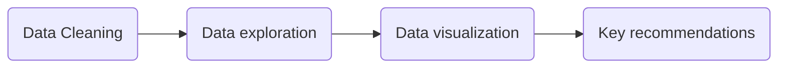

# Maven-Telecom-Churn-Analysis
## Introduction
In this project, I present my analysis and visualization of demographic details and key account records for 7,043 clients in California of Maven Communications. The data includes information about each cutomer’s demographic, location, tenure, add-on services, and status, which can be found in greater detail at **[Maven Analytics](https://www.mavenanalytics.io/data-playground)**.

The purpose of my analysis is to understand the churn rate, and the primary factors which influence this statistic. I will achieve this through looking at customer segmentation (based on monetary and loyalty value), and analysing the key indicators that increase churn risk. Based on these findings, I will provide recommendations to reduce churn rate and improve retention.

I used SQL (MySQL Workbench) for the entire analysis and Tableau for visualization. The primary steps of the project are outlined below:

## Insights
### 1) From customer perspective

-   Gender doesn’t strongly affect the churn rate.
-   Senior citizens are more likely to churn compared to younger groups.
-   Customers with no contact have a high churn rate
-   Newly joined customers with less than 0.5 years of tenure are less stable and more likely to leave.
-   Customers who have referred fewer than 4 people have a higher probability of churning.

### 2) From service perspective

-   Phone service doesn’t have much influence on churn rate
-   Customers are more likely to churn when using Fiber Optic internet service, possibly due to poor connection quality or outdated resources.
-   Offering online security, online backup, device protection plans, and premium tech support may help retain customers.
-   Customers are more likely to stay if they are provided promotional offers while offer E is the least attractive to keep customers.
-   There is high probability for churn if customers choose month-to-month contract.

### 3) From Payment perspective

-   A big proportion of paperless billing customers are churning.
-   Customers paying the bills through bank and mail have high potential to leave.
-   High-paying customers, who mostly subscribe to the Fiber Optic service, have a higher likelihood to churn.
   

## Suggestions
-   **Retain no-contact senior citizens**: Despite having a strong demand for extra services and high spending power, customers in this demographic have the highest churn rate over 50%. Maven could implement activities to attract and retain them, such as raffles, free SIM cards, and free upgrades to establish good relationships with customers.
-   **Revamp promotional offers:** With "Competitors making better offers" being the top reason for churn, Maven needs to adapt its promotional offers. More than half of the customers do not have any offer, so increasing advertisement to increase awareness of offers would be helpful. Offers A and B have good performance and should be maintained to retain customers. However, customers using offer E have a churn rate of 53%. Maven could consider discontinuing offer E or making changes to it.
-   **Training Customer service:** 12% of customers who left did so due to dissatisfaction of support staff attitude. Maven could provide additional training for support staff to improve customer satisfaction This is particularly important for the staff located in Glendale, as customer dissatisfaction was the number 1 factor for leaving in this city, which indicates a lack of appropriate training for staff in this region.
-   **Improve Fiber Optic Service:** Customers using Fiber Optic service have a high potential to leave, possibly due to service or device issues, as well as the higher price compared to other internet types. Since these customers are more likely to use streaming media services, it's important to improve internet connection quality and refresh the selection of shows and music. Maven could also consider re-pricing this service to retain customers.
-   **Introduce new contract plan:** The available contract periods are month-to-month, yearly, and 2-year contracts. Since there is no significant price difference among the three contract periods, and only one option for short-term contracts, customers are less likely to use long-term contracts, which are less flexible and affordable. Maven could offer a discount rate on long-term contracts to attract customers and make them more stable. Additionally, Maven could consider adding 3-month and 6-month contract options for customers.
-   **Engage High-Value Customers:** Among all stayed and joined customers, 65% of them have a high risk of churning. Maven needs to keep these customers from leaving through various ways, such as providing free add-on services with high retention rates like online security/online backup/device protection plan/premium tech support.

